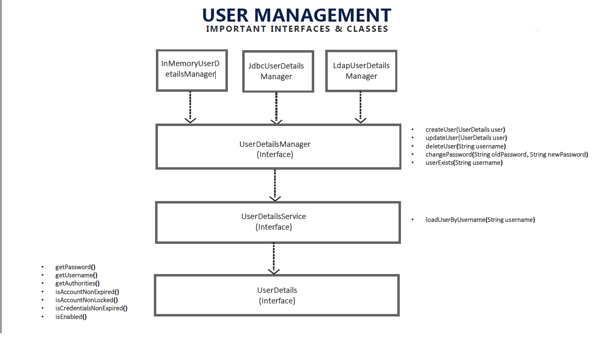

## USER MANAGEMENT

#### org.springframework.security.core.userdetails.UserDetails(Interface)

<pre>
Provides core user information.

Implementations are not used directly by Spring Security for security purposes.
They simply store user information which is later encapsulated into Authentication
objects. This allows non-security related user information (such as email addresses,
telephone numbers etc) to be stored in a convenient location.
All Known Implementing Classes:

org.springframework.security.core.userdetails.User
org.springframework.security.ldap.userdetails.Person
org.springframework.security.ldap.userdetails.LdapUserDetailsImpl
</pre>

#### org.springframework.security.core.userdetails.UserDetailsService(Interface)

<pre>
Core interface which loads user-specific data. It is used throughout the framework
as a user DAO and is the strategy used by the DaoAuthenticationProvider.
All Known Implementing Classes:

1) CachingUserDetailsService
2) InMemoryUserDetailsManager
3) JdbcDaoImpl
4) JdbcUserDetailsManager
5) LdapUserDetailsManager
6) LdapUserDetailsService

Note - if we use JdbcUserDetailsManager default implementation it looks for USERS & AUTHORITIES table
</pre>