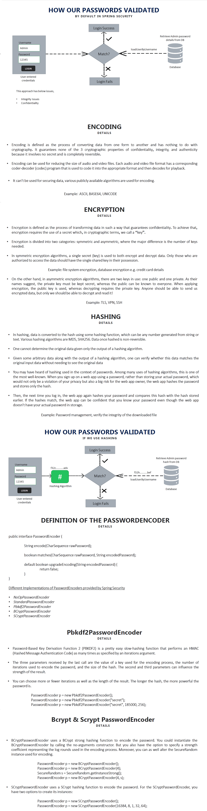

<pre>

AbstractUserDetailsAuthenticationProvider

public Authentication authenticate(Authentication authentication) throws AuthenticationException {
		Assert.isInstanceOf(UsernamePasswordAuthenticationToken.class, authentication,
				() -> this.messages.getMessage("AbstractUserDetailsAuthenticationProvider.onlySupports",
						"Only UsernamePasswordAuthenticationToken is supported"));
		String username = determineUsername(authentication);
		boolean cacheWasUsed = true;
		
		// First get from cache
		UserDetails user = this.userCache.getUserFromCache(username);
		// Not found - load from users table
		UserDetails loadedUser = this.getUserDetailsService().loadUserByUsername(username); // Default users 
		// Compare the password
		additionalAuthenticationChecks(user, (UsernamePasswordAuthenticationToken) authentication);
</pre>

###### Generate password using http://localhost:8080/spring-security/welcome&name=ssiqbal (Generated password using passwordEncoder.encode("Hello@123").)

###### Insert the generated password to users table.